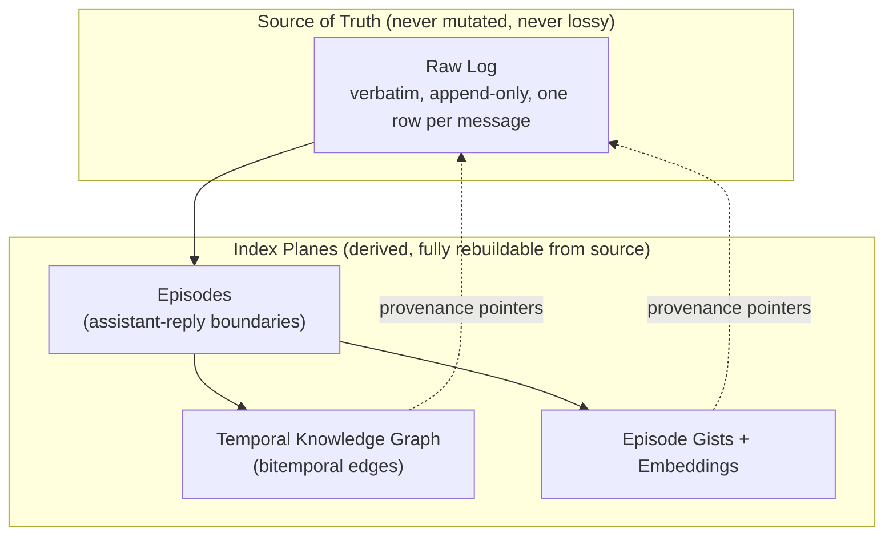
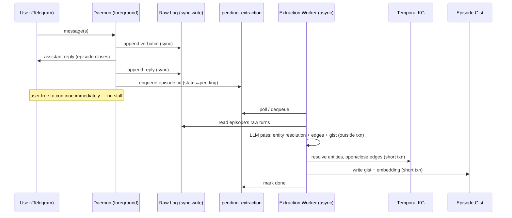
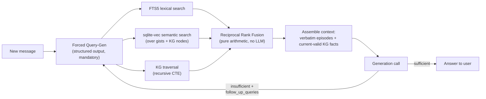

# Towa — Design Document

*A Telegram-native AI agent harness built around one thesis: memory recall is the product. "Eternity" (永遠) — never forgetting a detail, no matter how many years pass.*

---

## Table of Contents

1. [Philosophy](#1-philosophy)
2. [Data Model](#2-data-model)
3. [Storage Substrate](#3-storage-substrate)
4. [Write Path](#4-write-path)
5. [Retrieval Architecture](#5-retrieval-architecture)
6. [Agent Loop & Context Assembly](#6-agent-loop--context-assembly)
7. [Channel Layer](#7-channel-layer)
8. [Model Provider Strategy](#8-model-provider-strategy)
9. [Evaluations](#9-evaluations)
10. [Ops & Durability](#10-ops--durability)
11. [Explicitly Deferred / Rejected](#11-explicitly-deferred--rejected)
12. [Suggested Repo Layout](#12-suggested-repo-layout)
13. [Frameworks & Libraries](#13-frameworks--libraries)

---

## 1. Philosophy

Towa's north star is often stated as "never forget anything," but that phrase bundles two unrelated engineering problems that must be split immediately, because conflating them corrupts every downstream decision:

- **Storage** — keeping the raw record. This is a *non-problem*. Five years of heavy daily use (~500 msgs/day) is under a million rows and single-digit GB even with embeddings on every message. There is no scenario in which Towa needs to delete anything for space.
- **Recall** — surfacing the right record, out of years of history, into a bounded context window, at the right moment. This is the *entire* engineering challenge of the project.

**Core architectural rule: the raw log is immutable and lossless; everything else is a rebuildable index pointing back into it.**



"Compaction," in Towa, never means discarding fidelity from the source. It only ever means *building or pruning an index*. If you ever need to change your embedding model, rewrite your KG extraction prompts, or redesign retrieval entirely, you throw away and rebuild the index planes — the raw log never has to be touched or trusted less.

---

## 2. Data Model

### 2.1 Raw Log

Append-only, one row per **individual Telegram message** (not per logical turn — see §2.2 for why). No chunking, no interpretation at this layer.

```
raw_log
  id              INTEGER PRIMARY KEY  -- monotonic
  timestamp       INTEGER              -- unix epoch, message time
  role            TEXT                 -- 'user' | 'assistant'
  content         TEXT                 -- verbatim text (or transcript/caption for media — see §7.3)
  source_meta     JSON                 -- platform message id, reply-to id, media ref, raw payload
  edit_of         INTEGER NULL         -- FK to raw_log.id if this row is an edit event
  deleted_marker  BOOLEAN DEFAULT FALSE
```

Edits and deletes **never mutate a row in place** — they append a new row referencing the original (`edit_of`), or a delete-marker row. The raw log is a strict transcript of everything that ever crossed the wire.

**Read resolution:** verbatim turn loaders (working context, retrieved episodes, extraction) resolve each original id to the **latest non-deleted tip** targeting it via `edit_of` — including system `media_artifact` edits whose new ids fall outside the episode's `[start_msg_id, end_msg_id]` (enrichment runs after the episode closes; see §7.3). Edit rows are never listed as additional turns; the original id is preserved for episode identity and provenance.

### 2.2 Episodes (derived)

**Unit of KG extraction.** An episode is the run of consecutive user messages since the last assistant message, plus the assistant reply that closes it:

> `episode = { start_msg_id, end_msg_id }`, split deterministically on assistant-message boundaries in the raw log.

This gives burst-grouping ("hey" / "wait" / "so the thing is—" as three rapid messages) for free, with no persisted state — episodes are recomputed from source at any time.

This is distinct from the **runtime debounce** used to decide *when to respond* (see §6) — debounce is ephemeral inference-time state; the episode boundary is implied by the log itself once a reply has been sent.

```
episodes
  id              INTEGER PRIMARY KEY
  start_msg_id    INTEGER
  end_msg_id      INTEGER
  closed_at       INTEGER
```

### 2.3 Temporal Knowledge Graph

Nodes and edges are **schema-light and emergent** — Towa is a general-purpose harness with no foreknowledge of use case, so entity types and relation types are free-form strings the extractor coins on the fly, never a fixed enum. Only provenance and bitemporal columns are structural.

```
kg_nodes
  id              TEXT PRIMARY KEY     -- uuid
  type_label      TEXT                 -- free-form, e.g. "person", "project", "preference"
  canonical_name  TEXT
  aliases         JSON                 -- array of alternate names (populated by merges)
  attributes      JSON
  embedding       BLOB                 -- sqlite-vec vector, over canonical_name + attributes
  provenance      JSON                 -- array of raw_log / episode ids that support this node

kg_edges
  id              TEXT PRIMARY KEY
  subject_id      TEXT REFERENCES kg_nodes(id)
  relation_label  TEXT                 -- free-form, e.g. "lives_in", "sister_of"
  object_id       TEXT NULL REFERENCES kg_nodes(id)  -- NULL if object is a literal
  object_literal  TEXT NULL
  valid_from      INTEGER              -- world-time: when this became true
  valid_to        INTEGER              -- world-time: sentinel far-future value if still open (see below)
  ingested_at     INTEGER              -- transaction-time: when Towa learned this
  provenance      JSON                 -- episode id(s) that established/closed this edge
```

**Bitemporal semantics:**

- A fact holds over the half-open interval `[valid_from, valid_to)` in **valid time** (when it was true in the world) — orthogonal to `ingested_at`, which is **transaction time** (when Towa learned it, used only for "what did you believe back in March" audits).
- Facts are never deleted on contradiction — they are **closed** (`valid_to` set) and a new edge is opened. History is always intact.
- **Open edges use a far-future sentinel** (e.g. `9999-01-01`) instead of `NULL` for `valid_to`. This makes every temporal query a uniform `valid_from <= now AND now < valid_to` — no NULL-branching, clean range indexes, and correct handling of future-dated facts ("I'm moving next month").
- **Edge invalidation rule:** the extraction pass checks new edges against existing edges on the same `(subject, relation)`. Closes the old edge only on **clear contradiction** for relations that are inherently single-valued (residence, job, relationship status). For many-valued relations (friendships, projects), new mentions are **additive by default** — never silently replace.

### 2.4 Episode Gist

Emitted in the **same** LLM pass that does KG extraction (near-zero marginal cost) — a one-sentence, dense, embeddable handle on the episode. Unlike hierarchical rollups (rejected, see §11), the gist never stands in for the episode's content — it's purely a retrieval target; the agent always reads back the verbatim raw turns.

```
episode_gists
  episode_id      INTEGER REFERENCES episodes(id)
  gist_text       TEXT
  embedding       BLOB     -- sqlite-vec vector
```

---

## 3. Storage Substrate

**Single SQLite file. No database server, no separate graph engine, no message broker.**

| Concern | Choice | Why |
|---|---|---|
| Relational + graph storage | SQLite, single file | Zero-service durability story: `cp towa.db backup.db` is the entire backup strategy. Portable, syncable. Matches "one stateful thing forever" for a single-user tool. |
| Vector search | `sqlite-vec` | Brute-force linear scan is fine at single-user scale (tens of thousands of vectors, sub-10ms). No ANN index needed — the thing that would justify pgvector's HNSW doesn't exist here. |
| Lexical search | FTS5 (built-in) | BM25 in-engine, no extra dependency, sets up hybrid retrieval cleanly. |
| Graph traversal | Recursive CTEs over `kg_nodes`/`kg_edges` | At tens of thousands of edges, 2–3 hop traversal is sub-millisecond. A dedicated graph DB (Neo4j, Apache AGE) buys performance headroom this project will never use, at the cost of an extra service and a shakier extension-maintenance story. |
| Concurrency | WAL mode + `PRAGMA busy_timeout` | Readers never block on writers (WAL). The single-writer constraint only serializes writer-vs-writer, which here means two short, rarely-overlapping transactions (see §4.2) — `busy_timeout` turns any contention into a brief wait instead of an error. |
| Driver | `better-sqlite3` | Synchronous, fast for embedded single-user use, supports `loadExtension` for `sqlite-vec`. |

**Explicitly rejected:** Postgres+pgvector (server overhead not justified at this scale), Neo4j/Apache AGE (graph-DB justification evaporates at single-user scale; AGE's extension-maintenance story is a bad long-term bet), RabbitMQ (see §11).

---

## 4. Write Path

### 4.1 Timing: Async, not sync

Extraction (entity resolution, edge writes, gist generation) runs **after** the agent has already replied, off a background queue — never inline before the response, which would stall every message behind a multi-second LLM call.

**Why this is safe, not just fast:** the read-your-writes gap this could create is already closed by earlier layers. The raw log is written **synchronously** (a plain fast insert), so verbatim content is immediately searchable by FTS5/vec. Recently-stated facts also live in the working-context buffer (§6) regardless of KG state. The KG only needs to have caught up by the time a fact becomes *old* — and old facts were extracted long ago. A few seconds of extraction lag costs nothing in practice.

### 4.2 Queue & serialization

No message broker. A plain table is the durable work queue:

```
pending_extraction
  episode_id      INTEGER PRIMARY KEY REFERENCES episodes(id)
  status          TEXT     -- 'pending' | 'in_progress' | 'done'
  updated_at      INTEGER
```

- Foreground (channel handler): on episode close, `INSERT INTO pending_extraction ... status='pending'` — a sub-millisecond transaction.
- Background (drain loop, runs as an async worker inside the same daemon process — no separate OS process needed): polls for `pending`, marks `in_progress`, does the slow work **outside any transaction**, then commits results (KG writes + gist) and marks `done` in one short final transaction.
- SQLite's "one writer" constraint is per-instant, not per-process — any number of connections may *issue* writes; conflicting ones just serialize. Because both transactions here are short and rarely overlap, contention is a non-issue with `busy_timeout` set.
- Crash recovery: on restart, re-scan for `pending`/`in_progress` rows and resume. Nothing is lost — episodes are idempotently re-extractable from the raw log.



### 4.3 Entity resolution

Three-stage pipeline per new episode:

1. **Within-episode coreference** ("my sister" / "she" / "Anaya") — resolved by the same extraction LLM call reading the full episode; free.
2. **Cross-episode candidate generation** — name/fuzzy string match + embedding nearest-neighbor (`sqlite-vec` over node names) + graph corroboration (nodes already connected to other entities mentioned in this episode are boosted).
3. **Bounded LLM verification** against the top few candidates: "is this new mention the same entity as existing node X (with these attributes)?" — a structured yes/no decision, not open-ended judgment, so it holds up on small models.

**Bias toward not-merging when uncertain.** A false split (two nodes for the same real entity) is self-healing — a later `merge_entities(a, b)` maintenance operation reassigns edges without any data loss, since everything still points back to the raw log. A false merge actively corrupts the graph (wrong facts now traverse onto the wrong identity) and is much harder to undo. No match found → create a new node, always.

---

## 5. Retrieval Architecture

This is the core of the product. A new message lands; a few-thousand-token budget must be filled with the right slice of years of history.

### 5.1 Why not free-form agentic tool calls

The obvious design — give the model `search_memory`/`traverse_entity` tools and let it decide when to use them — fails in practice on smaller/local models, which frequently just don't call the tool. The fix is not "add a fallback pre-retrieval pass" (that only covers queries whose raw text already contains the right search terms — it whiffs on exactly the vague, underspecified recall Towa exists for, e.g. *"what was that restaurant you liked?"*).

**The actual fix: retrieval is a mandatory pipeline stage the model can only fill in, never skip.** Small models are unreliable at deciding *whether* to act, but reliable at *doing* a bounded task when always asked. So every stage below is forced, with structured output — there is no "whether to search" decision left for the model to fumble.

### 5.2 Pipeline



*(Loop is capped at a fixed K rounds, e.g. K=2–3 — a hard bound, not model discretion, so a stuck loop can't run away.)*

1. **Forced query-generation** — before answering, the model is given a required structured-output task: produce search queries + entity names from the message + recent context. Not a tool it can decline; a mandatory pipeline stage.
2. **Multi-signal search** — the three stores are complementary, not redundant:
   - *Lexical (FTS5)* catches exact tokens — names, numbers, rare words — that vector search's paraphrase-tolerance can miss.
   - *Semantic (sqlite-vec over gists + KG nodes)* catches paraphrase, "things like this."
   - *Graph (CTE traversal)* catches structurally-related facts neither of the above surfaces — multi-hop recall ("what's true about my sister") even when the current message never names the entity.
3. **RRF merge** — candidates from all three are fused by summing `1/(k + rank)` per candidate across lists. Pure arithmetic; sidesteps calibrating incomparable scores (BM25 vs. cosine) against each other.
4. **Context assembly** — resolves to **verbatim raw turns** from the winning episodes (never summaries-in-place-of-source), plus current-valid KG facts.
5. **Generation-doubles-as-gate** — the same call that answers the user also declares sufficiency via structured output: either `{answer}` or `{insufficient: true, follow_up_queries: [...]}`. No separate judge/relevance LLM call — the common case (context was enough) costs nothing extra; only a genuinely hard turn pays for a second round.

**Retrieved-context budget:** the "few-thousand-token budget" referenced above is not a fixed constant — it's the portion of the total per-turn token budget (§6) left over after the working-context buffer and reserved output are subtracted. RRF-ranked candidate episodes are added to context in order until that portion, measured via the active chat model's own `countTokens()` (§8.1, §8.3), is exhausted.

### 5.3 Temporal-aware retrieval

Default retrieval resolves **only currently-true facts**:

```sql
WHERE valid_from <= :now AND :now < valid_to   -- valid_to uses the far-future sentinel when open
```

Superseded (closed) edges are excluded by default. A dedicated **`get_history(entity, relation)`** target returns the full validity timeline when a question is explicitly historical ("what did I used to think about X?", "where did I live before?"). Implicit past-tense detection in query-gen can *widen* retrieval to include history as a soft hint, but is never load-bearing — it's not trusted as the sole gate to the historical layer, since that would be exactly the kind of small-model judgment call the rest of this design routes around.

When both current and historical facts land in context together, they are presented to the generation call as **distinct labeled blocks** so the model doesn't blur "you used to" with "you do."

---

## 6. Agent Loop & Context Assembly

Per turn: `system prompt + working-context buffer + retrieved memory (§5) + new message → generate`.

**Working-context buffer:** a sliding window of the most recent raw turns, **token-budgeted** (not count-budgeted, so long messages don't blow it by turn-count alone). The budget is computed per active chat model, not a fixed global constant: `budget = capabilities.contextWindow − reservedForSystemPrompt − reservedForOutput`, split between working-context and retrieved-context (§5) by a configurable ratio (default: even split). Turns are measured against this budget using the active model's own `countTokens()` (§8.1) rather than a shared estimator, since tokenization genuinely differs by provider — see §8.3 for how `contextWindow` is resolved per model and how `countTokens()` accuracy varies by loader. When a turn ages out of the window, it is **dropped, not summarized** — no rolling-summary layer. This is safe specifically because every episode is unconditionally gisted+embedded (§2.4) regardless of whether KG extraction judged anything "important" — so anything that ages out remains fully findable by the same forced-retrieval pipeline that runs every turn anyway. The window size is therefore a UX/cost tuning knob (avoiding unnecessary retrieval round-trips for content still obviously part of the live thread), not a correctness knob — nothing is ever actually lost.

**Session boundary:** an idle gap beyond a threshold (e.g. >2 hours) resets the working-context buffer rather than letting it slide continuously. The first message of a new session naturally triggers retrieval to pull back whatever's relevant; carrying yesterday's tail forward is dead weight.

**Burst debounce (runtime, ephemeral, distinct from the stored episode boundary in §2.2):** after a message arrives, wait for a short idle gap (extended by further messages or a Telegram `typing` signal) before generating a reply, with a max cap so a long monologue still gets a response. This state is never persisted — once a reply is sent, the episode boundary is recoverable from the log alone.

---

## 7. Channel Layer

### 7.1 Pluggable adapter interface

Telegram is the only implementation for v1, but the interface should not assume it — same shape should express Slack, WhatsApp, etc. later without rework. `source_meta` on the raw log row is already generic enough to carry any platform's native payload, so the abstraction work is entirely in ingestion; the data model never needs to know which channel a message came from.

```typescript
interface ChannelAdapter {
  start(): void;
  onMessage(handler: (msg: InboundMessage) => void): void;
  onEdit(handler: (edit: EditEvent) => void): void;
  onDelete(handler: (del: DeleteEvent) => void): void;
  onPresence?(handler: (p: PresenceEvent) => void): void;   // optional, widens debounce

  send(chatId: string, message: OutboundMessage): Promise<string>;  // returns platform message id
  fetchMedia(ref: MediaRef): Promise<{ data: Buffer; mimeType: string }>;
}

interface InboundMessage {
  chatId: string;
  role: 'user';
  content: string;
  timestamp: number;
  mediaRef?: MediaRef;
  raw: unknown;              // dumped straight into source_meta
}

type OutboundMessage =
  | { type: 'text'; text: string; recordInRawLog?: boolean }  // false = wire-only notice (no raw_log / episode close)
  | { type: 'image'; caption?: string; data: string; mimeType: string }  // base64
  | { type: 'video'; caption?: string; data: string; mimeType: string }  // base64
  | { type: 'audio'; caption?: string; data: string; mimeType: string }; // base64

interface MediaRef {
  platformFileId: string;
  mimeType: string;
  kind: 'image' | 'video' | 'audio' | 'file';
}
```

The core agent loop only ever talks to `ChannelAdapter` — it has no knowledge that Telegram exists. "Single eternal chat" is a config value (one allow-listed `chatId`) on the adapter, not special-cased logic.

**Transport mode is owned entirely by the adapter, internally.** `start()` is deliberately opaque about *how* it begins receiving events — polling, webhook, or websocket. The core harness never inspects or depends on which transport a given adapter uses; it only ever sees the normalized event callbacks. This has to be per-adapter rather than a shared harness-level setting, because the channels this interface is meant to eventually support genuinely differ in idiomatic transport: Telegram supports both polling and webhooks cleanly, Slack's idiomatic path is a websocket (Socket Mode), WhatsApp Business API is webhook-only. A cross-channel "transport mode" concept would be a false abstraction over things that aren't actually the same shape.

### 7.2 `TelegramAdapter`

Sole v1 implementation, built on **Telegraf** (§13). Translates Telegram Bot API events into the normalized shapes above; maps `OutboundMessage` variants to Telegraf's `sendMessage`/`sendPhoto`/`sendVideo`/`sendVoice`. Edits/deletes arrive as `EditEvent`/`DeleteEvent` and are appended to the raw log as new rows (§2.1) — never in-place mutation.

**Defaults to long-polling** (`bot.launch()`) — zero infrastructure for a single-user personal daemon: no public HTTPS endpoint, no reverse proxy, no TLS cert. Webhook mode remains available as an optional config path via Telegraf's own bundled `webhookCallback`, so it never requires adding a separate HTTP framework (Express/Fastify) to the project.

### 7.3 Media policy

**The raw log never stores media bytes — only a reference (`MediaRef`) plus, once available, a text-derived artifact.**

- At extraction time (§4), if an episode contains voice or image media, the worker calls `fetchMedia(ref)` and checks the active chat model's capabilities (§8.1): if `capabilities.audioInput` (for voice) or `capabilities.vision` (for images) is true, the raw bytes are passed directly into a multimodal `generate()` call to produce a transcript/description. There is no separate transcription library or pipeline — transcription and captioning are both just capability-gated multimodal generation. If the active model lacks the relevant capability, extraction degrades gracefully to recording that media of that kind existed, without content.
- The text artifact is written back with `appendRawLogEdit` (`source_meta.kind = "media_artifact"`) so FTS and edit-aware readers (§2.1) see it; the original row is never mutated.
- **Decision: transcripts/captions are eternal; raw media bytes are best-effort/ephemeral.** Platform file references (e.g. Telegram file IDs) typically expire, so the binary is not guaranteed retrievable months or years later — only its text-derived description is treated as durable memory. `fetchMedia` may also be called on-demand at query time if a retrieved episode's caption is insufficient to answer a question and the reference hasn't expired yet — an optional, best-effort path, not part of the durable guarantee.

---

## 8. Model Provider Strategy

### 8.1 Interface — segregated by capability

```typescript
interface LoadedChatModel {
  id: string;
  capabilities: {
    structuredOutput: boolean;
    vision: boolean;
    audioInput: boolean;
    contextWindow: number;
  };
  generate(input: GenerateInput): Promise<GenerateOutput>;
  countTokens(text: string): Promise<number>;
}

interface LoadedEmbeddingModel {
  id: string;
  dimensions: number;
  embed(texts: string[]): Promise<number[][]>;
}
```

Chat and embedding models are separate interfaces (not one interface with an optional `embed`), because loaders and call sites for each are genuinely different. Every loader below returns one of these two shapes; the harness never knows or cares whether the underlying model is local or remote.

**Structured-output fallback:** not every local model supports forced JSON/tool-schema output reliably. The harness checks `capabilities.structuredOutput` and falls back to prompt-based JSON + parse + one retry when false — this is what lets the forced-retrieval pipeline (§5) survive small local models without silently breaking.

### 8.2 Loaders

| Loader | Role | Notes |
|---|---|---|
| `loadOllama(config)` | chat | **Default for chat + extraction.** Ollama owns model residency (loads on request, unloads on idle) — see §8.3. Auto-`pull` if missing; zero-friction local, matches "clone and run" OSS story. |
| `loadLlamaCpp(config)` | chat | In-process GGUF inference via `node-llama-cpp`. No separate daemon at all — the purest local-only option, but model stays resident in VRAM for the daemon's entire lifetime (see §8.4 for why this is not the default). |
| `loadLocalEmbeddings(config)` | embedding | Local embedding model via `transformers.js`/ONNX, **run on CPU** (see §8.4). Fires every turn via query-gen, so this is where local-first matters most — no network round-trip on the highest-frequency call in the system. |
| `loadOpenAICompatible(config)` | chat | Universal remote/server escape hatch, parameterized by `baseURL` — covers OpenAI, OpenRouter, Groq, Together, vLLM, LM Studio, and Ollama's own OpenAI-compat endpoint in one loader. |
| `loadOpenAICompatibleEmbeddings(config)` | embedding | Same idea, embedding-specific endpoints. |
| `loadAnthropic(config)` | chat | Native Messages API — kept separate from the OpenAI-compat loader since tool-use/structured-output semantics differ enough to warrant a thin native implementation. |
| `loadHuggingFaceInference(config)` | embedding / chat | Remote HF Inference Endpoints (distinct from `loadLlamaCpp`, which loads local weight files). |

**Per-role configuration**, not one global model: `chatModel`, `extractionModel`, `embeddingModel` (and optional `visionModel`) are each configured independently, each pointed at any loader. Default out-of-the-box config is fully offline: Ollama for chat + extraction, local CPU embeddings. A user can e.g. swap just `chatModel` to Anthropic for quality while keeping extraction and embeddings local and free — this is what "local-first, remote optional" actually means in practice, expressed per-role rather than all-or-nothing.

### 8.3 Token counting & context-window registry

Context-window budgeting (§5, §6) needs two things that differ per provider and were previously left implicit: how many tokens a given model's context window actually holds, and how many tokens a given string costs on that model's own tokenizer.

**Context-window registry, with override.** A small static table shipped with the harness:

```typescript
const KNOWN_CONTEXT_WINDOWS: Record<string, number> = {
  'llama3.1:8b': 128_000,
  'qwen2.5:14b': 128_000,
  'claude-sonnet-5': 200_000,
  // ...
};
```

Every loader's config accepts an optional `contextWindow?: number` override — if a model id isn't in the table (a new release, a fine-tune, an obscure local model), the caller supplies it explicitly rather than the harness guessing or refusing to load. This value populates `capabilities.contextWindow` (§8.1). The table needs periodic manual updates as new models ship — a maintenance task, not a design decision (tracked in `CLAUDE.md`, not here).

**Per-loader `countTokens()` accuracy.** `LoadedChatModel.countTokens()` (§8.1) is implemented per loader, and accuracy genuinely varies by provider:

- **`loadLlamaCpp`** — exact. The loaded GGUF model carries its own tokenizer in-process; `node-llama-cpp` exposes it directly, at no network cost.
- **`loadOllama`** — approximate unless the running model exposes a tokenize endpoint; falls back to a bundled general-purpose estimator otherwise.
- **`loadAnthropic` / `loadOpenAICompatible` / `loadHuggingFaceInference`** — use the provider SDK's own counting utility where one exists; otherwise the same bundled estimator.

These counts exist for **budgeting, not billing** — Towa is protecting the context window from overflow, not optimizing spend to the token, so a slight overestimate is the safe failure direction.

### 8.4 Model residency, VRAM, and thermal considerations

This has a real hardware consequence, not just a performance one, and it's why Ollama — not in-process `llama.cpp` — is the default chat loader:

- **`loadLlamaCpp`** loads weights directly into the daemon's own process memory (VRAM if GPU-offloaded) at startup and keeps them resident for the daemon's entire lifetime. Since Towa is meant to run as an always-on daemon for years, this means a standing VRAM (and GPU heat) commitment around the clock, independent of whether anyone is actually messaging it.
- **`loadOllama`** runs as its own server that owns model residency — loading into VRAM on first request and unloading after an idle timeout (default ~5 min). The Towa daemon is just an HTTP client and never directly holds VRAM. GPU memory and heat are spent only during actual message bursts.

For a laptop GPU running an eternal-but-bursty personal chat (as opposed to a continuously-hammered production service), Ollama's load-on-demand/unload-on-idle model is the better fit on both efficiency and thermal grounds — GPU idles cool between conversations rather than staying loaded indefinitely. `loadLlamaCpp` remains available for users who want a zero-daemon, single-process setup and are comfortable with the always-resident tradeoff.

The **embedding model** is deliberately kept off the GPU question entirely — small embedding models (roughly 22M–110M params) run fast enough on CPU that there's no need to contend for VRAM on the harness's highest-frequency call.

---

## 9. Evaluations

Harness: **promptfoo + Langfuse** (already the production eval stack in use for Score AI — no reason to reinvent).

### 9.1 Internal gold-set evals

| Eval | Tests | Data source |
|---|---|---|
| Retrieval recall@k | Does the forced pipeline (§5) surface the right episode within K rounds | `(query, expected episode-id)` pairs mined from real usage |
| Entity resolution precision/recall | §4.3's bias-toward-split — track **false-merge rate** especially, since that's the costly failure mode | `(mention, expected node-id)` pairs |
| Temporal correctness | Present-vs-historical resolution (§5.3), edge invalidation (§2.3) | Small hand-built adversarial set: seed a fact, supersede it, query both present and `get_history` |
| North-star longitudinal recall | The actual product thesis — cold-query Towa about obscure one-off details at increasing time distances (1 week / 1 month / 6 months / 1 year+) | Periodically mined from the growing raw log |

### 9.2 External benchmark

Three benchmarks define this field in a way that's actually cross-comparable with other memory systems (Mem0, Zep/Graphiti, MemGPT/Letta): **LoCoMo** (1,540 questions — single-hop, multi-hop, open-domain, temporal), **LongMemEval** (500 questions — six categories including knowledge-update and multi-session recall), and **BEAM** (1M/10M-token scale, designed so no current architecture saturates it).

- **Primary: LongMemEval.** Its category breakdown maps closely onto Towa's own axes above (temporal reasoning ↔ §5.3's bitemporal work, knowledge-update ↔ §2.3's edge invalidation, multi-session-recall ↔ the north-star eval), and its "~40 haystack sessions per question" shape is closer to Towa's real usage pattern (years of small sessions) than LoCoMo's richer multi-party dialogue emphasis.
- **Secondary: LoCoMo**, reported for cross-referencing since it's the most commonly cited number in the space.
- **BEAM: noted, not targeted.** Explicitly built to remain unsaturated by current architectures — a fair frontier-research comparison, not a reasonable v1 bar for a single-developer OSS project.

**Caution to carry into interpretation:** static benchmark numbers in this space have shown real gaps against production behavior — e.g. one widely-cited system's benchmark score dropped roughly in half in independent production testing after 30 days once staleness and entity contradictions entered the picture. Treat LongMemEval/LoCoMo as dev-time regression checks; trust the north-star longitudinal eval (§9.1) as the number that actually matters, since unlike a static test set it's built to survive months and years of real, drifting use.

### 9.3 Testing scope

No separate unit/smoke-test framework for now. The gold-set evals above are the correctness signal — a standalone test suite at this stage would mostly duplicate what they already check. Revisit if a bug class recurs that evals don't catch (e.g. something at the schema/serialization layer that's orthogonal to retrieval/extraction quality).

---

## 10. Ops & Durability

- **Backup:** the single SQLite file is the entire backup unit — `cp towa.db backup.db`, or `litestream` for continuous replication to object storage (optional config toggle, not required).
- **Checkpointing:** scheduled WAL checkpoints.
- **Crash recovery:** already covered by `pending_extraction` (§4.2) — extraction is idempotently resumable from any `pending`/`in_progress` state.
- **Schema evolution:** a `schema_version` table + ordered migration scripts run on startup. No migration framework needed at this scale.

---

## 11. Explicitly Deferred / Rejected

Recorded so the reasoning isn't lost and isn't accidentally re-litigated without new evidence:

- **Hierarchical rollup summaries (day/month/quarter trees):** deferred. Every query class they'd serve is already covered by timestamp-ranged query-time synthesis or by the KG (high-connectivity nodes *are* the themes). Revisit only if evals (§9) surface a concrete query class neither covers within budget.
- **ReasoningBank (Google)-style procedural memory:** rejected as a memory store — it's designed to distill *lessons from verifiable task outcomes* and explicitly discards raw trajectories, which is the opposite of Towa's lossless-source thesis, and a private chat has no reliable success/failure signal to learn from. Noted as a possible *future, gated* optional layer specifically for learning retrieval-search strategies (not general memory), conditional on (a) evals showing the fixed forced-retrieval pipeline plateauing, and (b) a real success signal being available for retrieval outcomes.
- **RabbitMQ / any message broker:** rejected for the write-path queue. A broker is unjustified overhead for a single-user, single-writer, in-process flow — a SQLite table + drain loop covers it entirely.
- **Dedicated graph database (Neo4j, Apache AGE):** rejected. The performance case for a graph engine doesn't exist at single-user scale (tens of thousands of edges, sub-ms CTE traversal), and it would add an operational dependency the single-file/single-process durability model is specifically designed to avoid.
- **Synchronous (inline) extraction:** rejected — would stall every reply behind a multi-second LLM call. Async is safe because the raw log and working-context buffer already cover the read-your-writes gap for recently-stated facts.
- **Embedding cache layer:** considered and rejected — unnecessary storage/complexity overhead at this scale; `embed()` is called directly against the loaded model (local or remote) with no caching indirection.

---

## 12. Suggested Repo Layout

Left to the coding agent to execute against, sketched here only as a starting scaffold:

```
towa/
  src/
    core/
      raw-log/            # append-only writer, edit/delete handling
      episodes/            # boundary derivation
      kg/                  # nodes, edges, bitemporal logic, entity resolution
      gist/                
      retrieval/            # query-gen, multi-signal search, RRF, gate loop
      context-assembly/    # working-context window, session boundaries
      write-path/          # pending_extraction queue + drain worker
      harness/              # agent loop: debounce → retrieval → reply + drain start
    channels/
      adapter.ts            # ChannelAdapter interface + shared types
      telegram/
    models/
      loaders/               # loadOllama, loadLlamaCpp, loadOpenAICompatible, etc.
      types.ts               # LoadedChatModel / LoadedEmbeddingModel
    db/
      schema.sql
      migrations/
  evals/
    gold-sets/
    promptfoo/
  docs/
    towa-design.md          # this document
```

---

## 13. Frameworks & Libraries

Storage engines and model providers are covered in §3 and §8. This section covers the supporting libraries used to build on top of them — everything except the harness logic itself (retrieval, extraction, entity resolution, context assembly, etc.), which is custom-built from scratch, per the project's own scope.

| Concern | Library | Notes |
|---|---|---|
| SQL query building | **Kysely** | Type-safe query builder over `better-sqlite3` (§3). Chosen over a full ORM (Prisma, Drizzle relational mode) specifically because the design requires two things ORMs tend to fight or can't express: recursive CTEs for graph traversal (§5.2) and `sqlite-vec`'s custom virtual-table functions (`vec_distance_cosine`, etc.). Kysely's raw-fragment escape hatch handles both while keeping everything else type-safe. |
| Telegram integration | **Telegraf** | Implements `TelegramAdapter` (§7.2). Defaults to long-polling (`bot.launch()`) — zero infrastructure for a single-user daemon. Webhook mode is available via Telegraf's own bundled `webhookCallback`, so no separate HTTP framework is needed even then. |
| Structured-output validation | **Zod** | Validates every forced-pipeline structured output (query-gen, sufficiency gate, entity-resolution verification — §5.1, §4.3) after the JSON-parse fallback (§8.1). A malformed response from a less-capable local model fails loudly instead of silently corrupting state. |
| Logging | **Pino** | Structured info/debug/error logging throughout the daemon — write-path drain loop, retrieval pipeline stage counts, channel adapter message in/out, debounce firing. Low overhead, fits an always-on process. |
| Config / secrets | `process.env` (+ optional `dotenv` for local dev) | No config framework. Towa is invoked directly as `node entrypoint/main.js`; configuration is environment variables plus code that imports the harness. CLI packaging is out of scope for now, to be explored once the harness itself is fleshed out. |
| Token counting | Per-loader — `node-llama-cpp`'s tokenizer, provider SDKs, bundled estimator fallback | See §8.3 for the full breakdown by loader. |
| Testing | Evals only — promptfoo + Langfuse (§9) | See §9.3. |

**Deliberately not introduced:** an HTTP framework (Telegraf covers webhook mode natively — §7.2), a CLI framework (deferred until CLI packaging is explored), a migration framework (§10 — hand-rolled scripts are sufficient at this scale), an embedding cache (§11 — tried and backed out), a message broker (§11 — a table + drain loop covers the write-path queue), a dedicated audio-transcription library (§7.3 — routed through multimodal chat models via `capabilities.audioInput` instead), a full ORM (§13 above — Kysely was chosen specifically to avoid this).
