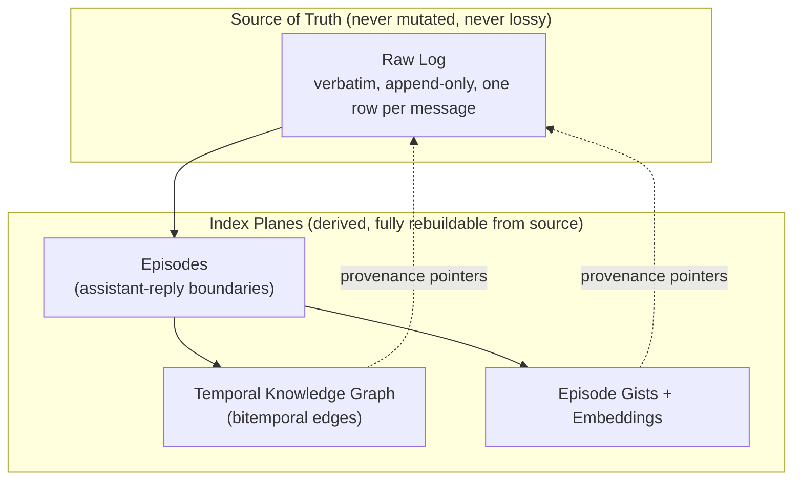
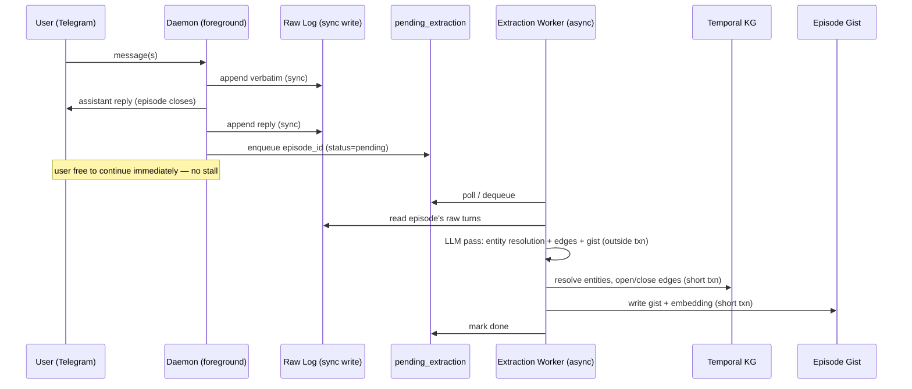
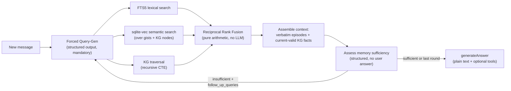

# Towa — Design Document

*A Telegram-native AI agent harness built around one thesis: memory recall is the product. "Eternity" (永遠) — never forgetting a detail, no matter how many years pass.*

---

## Table of Contents

1. [Philosophy](#1-philosophy)
2. [Data Model](#2-data-model)
3. [Storage Substrate](#3-storage-substrate)
4. [Write Path](#4-write-path)
5. [Retrieval Architecture](#5-retrieval-architecture)
6. [Agent Loop & Context Assembly](#6-agent-loop--context-assembly)
7. [Channel Layer](#7-channel-layer)
8. [Model Provider Strategy](#8-model-provider-strategy)
9. [Evaluations](#9-evaluations)
10. [Ops & Durability](#10-ops--durability)
11. [Explicitly Deferred / Rejected](#11-explicitly-deferred--rejected)
12. [Suggested Repo Layout](#12-suggested-repo-layout)
13. [Frameworks & Libraries](#13-frameworks--libraries)

---

## 1. Philosophy

Towa's north star is often stated as "never forget anything," but that phrase bundles two unrelated engineering problems that must be split immediately, because conflating them corrupts every downstream decision:

- **Storage** — keeping the raw record. This is a *non-problem*. Five years of heavy daily use (~500 msgs/day) is under a million rows and single-digit GB even with embeddings on every message. There is no scenario in which Towa needs to delete anything for space.
- **Recall** — surfacing the right record, out of years of history, into a bounded context window, at the right moment. This is the *entire* engineering challenge of the project.

**Core architectural rule: the raw log is immutable and lossless; everything else is a rebuildable index pointing back into it.**



"Compaction," in Towa, never means discarding fidelity from the source. It only ever means *building or pruning an index*. If you ever need to change your embedding model, rewrite your KG extraction prompts, or redesign retrieval entirely, you throw away and rebuild the index planes — the raw log never has to be touched or trusted less.

---

## 2. Data Model

### 2.1 Raw Log

Append-only, one row per **individual Telegram message** (not per logical turn — see §2.2 for why). No chunking, no interpretation at this layer.

```
raw_log
  id                 INTEGER PRIMARY KEY  -- monotonic
  timestamp          INTEGER              -- unix epoch, message time
  role               TEXT                 -- 'user' | 'assistant'
  content            TEXT                 -- verbatim text (or transcript/caption for media — see §7.3)
  chat_id            TEXT NULL            -- platform chat id (stringified)
  message_id         TEXT NULL            -- platform message id (stringified); edit lookup key with chat_id
  media_file_id      TEXT NULL            -- durable platform file id (no bytes)
  media_mime_type    TEXT NULL
  media_kind         TEXT NULL            -- 'image' | 'audio' | 'video' | 'file'
  media_file_name    TEXT NULL            -- original filename when provided
  is_media_artifact  BOOLEAN DEFAULT FALSE -- system transcript/caption edit tip (§7.3)
  edit_of            INTEGER NULL         -- FK to raw_log.id if this row is an edit event
  deleted_marker     BOOLEAN DEFAULT FALSE
```

Edits and deletes **never mutate a row in place** — they append a new row referencing the original (`edit_of`), or a delete-marker row. The raw log is a strict transcript of everything that ever crossed the wire.

**Read resolution:** verbatim turn loaders (working context, retrieved episodes, extraction) resolve each original id to the **latest non-deleted tip** targeting it via `edit_of` — including system media-artifact edits (`is_media_artifact`) whose new ids fall outside the episode's `[start_msg_id, end_msg_id]` (enrichment runs after the episode closes; see §7.3). Edit rows are never listed as additional turns; the original id is preserved for episode identity and provenance. Platform edit lookup uses `(chat_id, message_id)` columns — not JSON digging.

### 2.2 Episodes (derived)

**Unit of KG extraction.** An episode is the run of consecutive user messages since the last assistant message, plus the assistant reply that closes it:

> `episode = { start_msg_id, end_msg_id }`, split deterministically on assistant-message boundaries in the raw log.

This gives burst-grouping ("hey" / "wait" / "so the thing is—" as three rapid messages) for free, with no persisted state — episodes are recomputed from source at any time.

This is distinct from the **runtime debounce** used to decide *when to respond* (see §6) — debounce is ephemeral inference-time state; the episode boundary is implied by the log itself once a reply has been sent.

```
episodes
  id              INTEGER PRIMARY KEY
  start_msg_id    INTEGER
  end_msg_id      INTEGER
  closed_at       INTEGER
```

### 2.3 Temporal Knowledge Graph

Nodes and edges are **schema-light and emergent** — Towa is a general-purpose harness with no foreknowledge of use case, so entity types and relation types are free-form strings the extractor coins on the fly, never a fixed enum. Only provenance and bitemporal columns are structural.

```
kg_nodes
  id              TEXT PRIMARY KEY     -- uuid
  type_label      TEXT                 -- free-form, e.g. "person", "project", "preference"
  canonical_name  TEXT
  aliases         JSON                 -- array of alternate names (populated by merges)
  attributes      JSON
  embedding       BLOB                 -- sqlite-vec vector, over canonical_name + attributes
  provenance      JSON                 -- array of raw_log / episode ids that support this node

kg_edges
  id              TEXT PRIMARY KEY
  subject_id      TEXT REFERENCES kg_nodes(id)
  relation_label  TEXT                 -- free-form, e.g. "lives_in", "sister_of"
  object_id       TEXT NULL REFERENCES kg_nodes(id)  -- NULL if object is a literal
  object_literal  TEXT NULL
  valid_from      INTEGER              -- world-time: when this became true
  valid_to        INTEGER              -- world-time: sentinel far-future value if still open (see below)
  ingested_at     INTEGER              -- transaction-time: when Towa learned this
  provenance      JSON                 -- episode id(s) that established/closed this edge
```

**Bitemporal semantics:**

- A fact holds over the half-open interval `[valid_from, valid_to)` in **valid time** (when it was true in the world) — orthogonal to `ingested_at`, which is **transaction time** (when Towa learned it, used only for "what did you believe back in March" audits).
- Facts are never deleted on contradiction — they are **closed** (`valid_to` set) and a new edge is opened. History is always intact.
- **Open edges use a far-future sentinel** (e.g. `9999-01-01`) instead of `NULL` for `valid_to`. This makes every temporal query a uniform `valid_from <= now AND now < valid_to` — no NULL-branching, clean range indexes, and correct handling of future-dated facts ("I'm moving next month").
- **Edge invalidation rule:** the extraction pass checks new edges against existing edges on the same `(subject, relation)`. Closes the old edge only on **clear contradiction** for relations that are inherently single-valued (residence, job, relationship status). For many-valued relations (friendships, projects), new mentions are **additive by default** — never silently replace.
- **KG salience is fact-level, not episode-level:** store only durable personal facts and preferences (identity, likes/dislikes, people/places the user cares about, stated plans, lasting attributes) — including prefs mentioned casually in chitchat. Do not write greetings-only content, agent meta ("I don't recall"), or world-knowledge / encyclopedia Q&A from either side. Empty `entities`/`edges` is correct when nothing personal is durable; the episode gist remains unconditional (§2.4). This is prompt-side filtering in the same extraction pass — not a separate relevance-judge call, and not episode-level skipping of gist/embedding.

### 2.4 Episode Gist

Emitted in the **same** LLM pass that does KG extraction (near-zero marginal cost) — a one-sentence, dense, embeddable handle on the episode. Unlike hierarchical rollups (rejected, see §11), the gist never stands in for the episode's content — it's purely a retrieval target; the agent always reads back the verbatim raw turns.

```
episode_gists
  episode_id      INTEGER REFERENCES episodes(id)
  gist_text       TEXT
  embedding       BLOB     -- sqlite-vec vector
```

---

## 3. Storage Substrate

**Single SQLite file. No database server, no separate graph engine, no message broker.**

| Concern | Choice | Why |
|---|---|---|
| Relational + graph storage | SQLite, single file | Zero-service durability story: `cp towa.db backup.db` is the entire backup strategy. Portable, syncable. Matches "one stateful thing forever" for a single-user tool. |
| Vector search | `sqlite-vec` | Brute-force linear scan is fine at single-user scale (tens of thousands of vectors, sub-10ms). No ANN index needed — the thing that would justify pgvector's HNSW doesn't exist here. |
| Lexical search | FTS5 (built-in) | BM25 in-engine, no extra dependency, sets up hybrid retrieval cleanly. |
| Graph traversal | Recursive CTEs over `kg_nodes`/`kg_edges` | At tens of thousands of edges, 2–3 hop traversal is sub-millisecond. A dedicated graph DB (Neo4j, Apache AGE) buys performance headroom this project will never use, at the cost of an extra service and a shakier extension-maintenance story. |
| Concurrency | WAL mode + `PRAGMA busy_timeout` | Readers never block on writers (WAL). The single-writer constraint only serializes writer-vs-writer, which here means two short, rarely-overlapping transactions (see §4.2) — `busy_timeout` turns any contention into a brief wait instead of an error. |
| Driver | `better-sqlite3` | Synchronous, fast for embedded single-user use, supports `loadExtension` for `sqlite-vec`. |

**Explicitly rejected:** Postgres+pgvector (server overhead not justified at this scale), Neo4j/Apache AGE (graph-DB justification evaporates at single-user scale; AGE's extension-maintenance story is a bad long-term bet), RabbitMQ (see §11).

---

## 4. Write Path

### 4.1 Timing: Async, not sync

Extraction (entity resolution, edge writes, gist generation) runs **after** the agent has already replied, off a background queue — never inline before the response, which would stall every message behind a multi-second LLM call. The same pass applies **fact-level KG salience** (§2.3): only durable personal facts become nodes/edges; the gist is always written.

**Why this is safe, not just fast:** the read-your-writes gap this could create is already closed by earlier layers. The raw log is written **synchronously** (a plain fast insert), so verbatim content is immediately searchable by FTS5/vec. Recently-stated facts also live in the working-context buffer (§6) regardless of KG state. The KG only needs to have caught up by the time a fact becomes *old* — and old facts were extracted long ago. A few seconds of extraction lag costs nothing in practice.

### 4.2 Queue & serialization

No message broker. A plain table is the durable work queue:

```
pending_extraction
  episode_id      INTEGER PRIMARY KEY REFERENCES episodes(id)
  status          TEXT     -- 'pending' | 'in_progress' | 'done'
  updated_at      INTEGER
```

- Foreground (channel handler): on episode close, `INSERT INTO pending_extraction ... status='pending'` — a sub-millisecond transaction.
- Background (drain loop, owned by the daemon process — no separate OS process): repeatedly calls the daemon's `processNextExtraction` tick, which claims at most one `pending`/`in_progress` episode via core queue helpers (`listResumableExtractions`), then calls core's `runExtraction` (marks `in_progress`, does the slow work **outside any transaction**, commits KG writes + gist and marks `done` in one short final transaction). Core exports the KG/queue primitives only; the daemon owns the tick, scheduling, idle sleep, and shutdown.
- SQLite's "one writer" constraint is per-instant, not per-process — any number of connections may *issue* writes; conflicting ones just serialize. Because both transactions here are short and rarely overlap, contention is a non-issue with `busy_timeout` set.
- Crash recovery: on restart, re-scan for `pending`/`in_progress` rows and resume. Nothing is lost — episodes are idempotently re-extractable from the raw log.



### 4.3 Entity resolution

Three-stage pipeline per new episode:

1. **Within-episode coreference** ("my sister" / "she" / "Anaya") — resolved by the same extraction LLM call reading the full episode; free.
2. **Cross-episode candidate generation** — name/fuzzy string match + embedding nearest-neighbor (`sqlite-vec` over node names) + graph corroboration (nodes already connected to other entities mentioned in this episode are boosted).
3. **Bounded LLM verification** against the top few candidates: "is this new mention the same entity as existing node X (with these attributes)?" — a structured yes/no decision, not open-ended judgment, so it holds up on small models.

**Bias toward not-merging when uncertain.** A false split (two nodes for the same real entity) is self-healing — a later `merge_entities(a, b)` maintenance operation reassigns edges without any data loss, since everything still points back to the raw log. A false merge actively corrupts the graph (wrong facts now traverse onto the wrong identity) and is much harder to undo. No match found → create a new node, always.

---

## 5. Retrieval Architecture

This is the core of the product. A new message lands; a bounded context pack (fixed top-K working turns + top-K retrieved episodes, optionally tightened by headroom) must be filled with the right slice of years of history.

### 5.1 Why not free-form agentic tool calls

The obvious design — give the model `search_memory`/`traverse_entity` tools and let it decide when to use them — fails in practice on smaller/local models, which frequently just don't call the tool. The fix is not "add a fallback pre-retrieval pass" (that only covers queries whose raw text already contains the right search terms — it whiffs on exactly the vague, underspecified recall Towa exists for, e.g. *"what was that restaurant you liked?"*).

**The actual fix: retrieval is a mandatory pipeline stage the model can only fill in, never skip.** Small models are unreliable at deciding *whether* to act, but reliable at *doing* a bounded task when always asked. So every stage below is forced, with structured output — there is no "whether to search" decision left for the model to fumble.

### 5.2 Pipeline



*(Memory loop is capped at a fixed K rounds, e.g. K=2–3 — a hard bound, not model discretion, so a stuck loop can't run away. The answer tool loop has its own separate hard cap.)*

1. **Forced query-generation** — before answering, the model is given a required structured-output task: produce search queries + entity names from the message + recent context. Not a tool it can decline; a mandatory pipeline stage.
2. **Multi-signal search** — the three stores are complementary, not redundant:
   - *Lexical (FTS5)* catches exact tokens — names, numbers, rare words — that vector search's paraphrase-tolerance can miss.
   - *Semantic (sqlite-vec over gists + KG nodes)* catches paraphrase, "things like this."
   - *Graph (CTE traversal)* catches structurally-related facts neither of the above surfaces — multi-hop recall ("what's true about my sister") even when the current message never names the entity.
3. **RRF merge** — candidates from all three are fused by summing `1/(k + rank)` per candidate across lists. Pure arithmetic; sidesteps calibrating incomparable scores (BM25 vs. cosine) against each other.
4. **Context assembly** — resolves to **verbatim raw turns** from the winning episodes (never summaries-in-place-of-source), plus current-valid KG facts.
5. **Assess memory sufficiency** — a dedicated structured call declares whether retrieved memory is enough for *personal-memory* questions: `{insufficient: false}` or `{insufficient: true, follow_up_queries: [...]}`. It does **not** produce the user-facing reply (combining answer + gate in one schema was unreliable in practice, and native tool calling does not mix cleanly with that dual schema).
6. **generateAnswer** — after the memory loop settles (sufficient, or last round), a separate plain-text generation produces the user reply. When tools are enabled in daemon config and `capabilities.toolCalling` is true, this call runs a bounded native tool loop (§5.4). Headroom `promptTokens` come from this answer generate.

**Retrieved-context packing:** RRF-ranked candidate episodes are taken in rank order up to a fixed **top-K** (code default; see §6). There is no pre-call `countTokens()` fill-until-budget — tokenizer estimates are unreliable across local models (Gemma/Qwen vs tiktoken), and Ollama/OpenAI usage fields only arrive *after* the generate call. Under headroom pressure from the previous turn's reported prompt tokens (§6), K is tightened for the next turn rather than failing or retrying the current one.

### 5.3 Temporal-aware retrieval

Default retrieval resolves **only currently-true facts**:

```sql
WHERE valid_from <= :now AND :now < valid_to   -- valid_to uses the far-future sentinel when open
```

Superseded (closed) edges are excluded by default. A dedicated **`get_history(entity, relation)`** target returns the full validity timeline when a question is explicitly historical ("what did I used to think about X?", "where did I live before?"). Implicit past-tense detection in query-gen can *widen* retrieval to include history as a soft hint, but is never load-bearing — it's not trusted as the sole gate to the historical layer, since that would be exactly the kind of small-model judgment call the rest of this design routes around.

When both current and historical facts land in context together, they are presented to the generation call as **distinct labeled blocks** so the model doesn't blur "you used to" with "you do."

### 5.4 Non-memory agent tools

§5.1 rejects free-form **memory** tools (`search_memory`, etc.). Non-memory capabilities — web search/fetch and filesystem access — are different: they are **built-in tools** (not user-defined via config), enabled by daemon YAML booleans, and attached only to `generateAnswer` after forced retrieval.

| Tool | Backend | Notes |
|---|---|---|
| `web_search` | SerpAPI or Firecrawl | Provider via `tools.web.search` (`serpapi` \| `firecrawl`); keys `SERPAPI_API_KEY` / `FIRECRAWL_API_KEY` |
| `web_fetch` | Firecrawl or native `fetch` | Provider via `tools.web.fetch` (`firecrawl` \| `fetchapi`); Firecrawl needs `FIRECRAWL_API_KEY`; `fetchapi` needs none (rough HTML→text, size-capped) |
| `fs_list` / `fs_read` / `fs_write` | local FS | sandbox root + config allowlist + per-turn path grant when the path string appears in the user message; `fs_write` may take `source: "media:N"` for turn-scoped inbound media bytes |

No plugin registry. Scheduling / code execution / mini-apps are deferred until this tool loop exists (§11). Tool calling must not be combined with structured `response_format` on the same generate call.

---

## 6. Agent Loop & Context Assembly

Per turn: forced memory retrieval loop (§5.2) → `generateAnswer` (plain text, optionally with tools). Message shape for both assess and answer: `system prompt + working-context turns (as real user/assistant messages) + final user message (retrieved memory §5 + current text, with multimodal parts when applicable)`.

**Working-context buffer:** a sliding window of the most recent raw turns, packed by a fixed **top-K turn count** (after the session boundary), not by pre-call token measurement. When a turn ages out of the window, it is **dropped, not summarized** — no rolling-summary layer. This is safe specifically because every episode is unconditionally gisted+embedded (§2.4) regardless of whether KG extraction judged anything "important" — so anything that ages out remains fully findable by the same forced-retrieval pipeline that runs every turn anyway. The window size is therefore a UX/cost tuning knob (avoiding unnecessary retrieval round-trips for content still obviously part of the live thread), not a correctness knob — nothing is ever actually lost. Because inbound turns are persisted before retrieval runs, the trailing unanswered user burst is **excluded** from the working-context window and supplied only as the live `message` (+ media) on the final user turn for query-gen, sufficiency assess, and answer generate — so it is not double-counted.

**Headroom governor (next-turn throttle):** after each turn's **answer** generate, the harness records `usage.promptTokens` from the provider response (OpenAI-compatible `usage.prompt_tokens`, when present) per chat, along with whether that turn's packing was already tightened. The next turn compares consecutive samples **relatively** — no absolute context-window size is required or stored. Code defaults: meaningful rise (`last / previous ≥ ~1.15`) tightens both working and retrieved top-K (half of defaults, with small floors); once tightened, pressure sticks until a substantial drop (`last / previous < ~0.85`) releases back to defaults; cold start / single sample / missing usage → defaults. Packing/headroom constants are **not** daemon YAML knobs — only debounce and `session_idle_threshold_sec` are exposed there. This is deliberately **not** shrink-on-failure for the current turn — no overflow retry loop; pressure only affects subsequent packing. Usage metrics are never a substitute for deciding which *candidate* block fits mid-assembly; they only govern how aggressive the next fixed-K pack is.

**Session boundary:** an idle gap beyond a threshold (e.g. >2 hours) resets the working-context buffer rather than letting it slide continuously. The first message of a new session naturally triggers retrieval to pull back whatever's relevant; carrying yesterday's tail forward is dead weight.

**Burst debounce (runtime, ephemeral, distinct from the stored episode boundary in §2.2):** after a message arrives, wait for a short idle gap (extended by further messages) before generating a reply, with a max cap so a long monologue still gets a response. The harness joins every message in the fired burst into one generation input (not only the latest). Messages that arrive for the same chat while a turn is already in flight are folded into that turn — regenerating once before deliver — rather than becoming a second reply. This state is never persisted — once a reply has been delivered and recorded, the episode boundary is recoverable from the log alone. (Telegram Bot API does not deliver private-chat typing/presence to bots, so debounce is message-driven only.)

**Outbound delivery surface:** the harness does **not** send on the wire. Each completed logical turn notifies `onTurnCompleted` listeners with a `TurnResult` (`{ chatId, outbound }`). The daemon sends via `telegram.send` in that callback. Async handlers are **awaited** before the next queued turn starts — delivery backpressure lives here, not in `handleTurn`. Error apologies, `/start` help, and similar transport-only notices are included in `TurnResult.outbound` with `recordInRawLog: false`; the harness decides durability flags and never calls transport itself.

**Slash-command intercept (harness-local, before retrieval):** leading `/` commands are parsed as plain text in the agent loop — not via channel-specific command APIs (e.g. Telegraf `bot.command`). `/start` returns a short help blurb (wire-only; not recorded in `raw_log`). `/init` starts or resumes a short adaptive fact-goal interview (structured interviewer LLM; soft target ~10 turns, hard cap 15) that skips the forced-retrieval pipeline while active; `/init cancel` stops asking without wiping already-resolved goals. Interview replies go through the normal `onTurnCompleted` → `telegram.send` path so they enter durable memory; extraction still runs asynchronously as usual.

---

## 7. Telegram + Harness Wiring

Towa is **Telegram-native**. There is no pluggable `ChannelAdapter` and no dual-DTO translation layer between a generic channel port and Telegram. Shared message shapes (`InboundMessage`, `OutboundMessage`, `MediaRef`, `TurnResult`, …) use generic names so the harness and Telegram module can share them directly; Telegram-specific types (Telegraf `Message`, bot config) stay in the Telegram module. A future second surface (if ever) would call the same harness methods — not implement a channel-adapter interface.

### 7.1 Programmatic harness + Telegram runtime

The harness and Telegram runtime are created **separately**. The harness is a programmatic agent controller: it does **not** register bot callbacks, own Telegraf, inject `send`, or start an extraction poll loop. The **daemon** owns bot callback registration, `processNextExtraction` (composing core's `runExtraction` + queue helpers with db + models only — no media port), the extraction poll loop, and outbound sending. Core stays library-like: no long-running process starters.

```typescript
// Shared shapes (generic names; used by harness + Telegram)
type MediaKind = 'image' | 'audio' | 'video' | 'file';

interface MediaRef {
  fileId: string;
  mimeType: string;
  kind: MediaKind;
  data?: string;             // ephemeral base64 — never written to raw_log
}

interface InboundMessage {
  chatId: string;
  messageId: string;         // platform message id
  role: 'user';
  content: string;
  timestamp: number;
  media?: MediaRef;          // may include ephemeral base64 `data` for harness
}

type OutboundMessage =
  | { type: 'text'; text: string; recordInRawLog?: boolean }  // false = wire-only notice
  | { type: 'image'; caption?: string; data: string; mimeType: string }
  | { type: 'video'; caption?: string; data: string; mimeType: string }
  | { type: 'audio'; caption?: string; data: string; mimeType: string };

interface TurnResult {
  chatId: string;
  outbound: OutboundMessage[];
}

type SendOutbound = (chatId: string, message: OutboundMessage) => Promise<string>;

interface Harness {
  start(): void;             // debounce only — not Telegram, not drain
  stop(): Promise<void>;
  /** Accept into debounce/queue; resolves promptly (does not wait for generation). */
  handleTurn(msg: InboundMessage): Promise<void>;
  onTurnCompleted(handler: (result: TurnResult) => void | Promise<void>): () => void;
}

// Daemon wiring (sketch):
const telegram = createTelegram(db, { botToken, chatId });
const harness = createHarness({ db, chatModel, embeddingModel, … });

harness.onTurnCompleted(async (result) => {
  for (const out of result.outbound) {
    await telegram.send(result.chatId, out);
  }
});

// Daemon owns the extraction tick + poll loop; core exports runExtraction / queue helpers.
startExtractionDrainLoop({ db, chatModel, embeddingModel, … });

telegram.start((msg) => harness.handleTurn(msg));
```

**Inbound:** Telegram owns transport + inbound raw_log append. Before calling the daemon's inbound callback, it downloads media (`file_id` → base64 on `media.data` and into a process-local media-byte cache keyed by `fileId`) and writes durable media columns (`media_file_id` / `media_mime_type` / `media_kind`) plus `chat_id` / `message_id` — no opaque `source_meta` blob. Telegram Message → `MediaRef` mapping uses typed Telegraf field checks under `src/telegram/`. The daemon then calls `harness.handleTurn(msg)`. **Outbound:** the harness builds `TurnResult.outbound` and notifies `onTurnCompleted`; the daemon calls `telegram.send`, which maps `OutboundMessage` to Bot API helpers and, when recording, appends the assistant row and closes the episode (§2.2 / §4). **Drain:** daemon-owned poll loop calls local `processNextExtraction({ db, chatModel, embeddingModel })`, which uses core's `listResumableExtractions` + `runExtraction` — no `fetchMedia` injection. Enrichment reads the process-local cache; cache miss → text note only (no Telegram re-fetch). `fetchMedia` is **not** exposed on `TelegramRuntime`.

**"Single eternal chat"** is a config value (one allow-listed `chatId`) on the Telegram runtime.

**Transport mode** (long-polling vs webhook) is owned entirely inside the Telegram module. The harness never inspects how updates arrive.

### 7.2 Telegram runtime (`createTelegram`)

Built on **Telegraf** (§13). Normalizes Bot API events into the shared shapes above; maps `OutboundMessage` variants to `sendMessage` / `sendPhoto` / `sendVideo` / `sendVoice`. Platform message edits are **not** wired yet (no `edited_message` handler); when added, they must append via `appendRawLogEdit` (§2.1) — never in-place mutation. Slash commands (`/start`, `/init`, …) are not registered as Telegraf commands — they arrive as ordinary text and are intercepted in the harness (§6). `start(inbound)` takes a single inbound callback — the daemon wires `telegram.start((msg) => harness.handleTurn(msg))`; there is no `telegram.start(harness)` and no multi-handler bag.

**Defaults to long-polling** (`bot.launch()`) — zero infrastructure for a single-user personal daemon. Webhook mode remains available as an optional config path via Telegraf's own bundled `webhookCallback`, so it never requires adding a separate HTTP framework.

### 7.3 Media policy

**The raw log never stores media bytes — only durable columns (`media_file_id` / `media_mime_type` / `media_kind`) plus, once available, a text-derived artifact.** Extraction loads an `EpisodeTurn` with first-class `media?: MediaRef` and `messageId` mapped from those columns — it does not scrape JSON.

- On the inbound path, Telegram resolves `file_id` → base64 and attaches it to the in-memory `InboundMessage.media.data` before `handleTurn`, and seeds a **process-local media-byte cache** (keyed by `fileId`) for later drain enrichment. That payload is never written to SQLite (only durable `MediaRef` fields land in columns). Outbound `send` of binary media also seeds the cache from bytes already held.
- **Reply path:** before forced retrieval/generation, the harness runs a **sync media caption** for inbound images (vision `generate`) and **Telegram voice notes** (OpenAI-compatible `/v1/audio/transcriptions` — e.g. Ollama Gemma4; no host ffmpeg) and folds that text into the live user message. When `capabilities.vision` is true and image bytes are present, image `MessagePart`s are also attached to the answer `generate()` call. Voice reaches the model as transcript text only. Music/file audio uploads and video are unsupported inbound (static reply). If the model lacks the capability or bytes are missing, the reply path degrades to an explicit text note.
- At extraction time (§4), if an episode turn has `media`, enrichment prefers any in-memory `MediaRef.data`, else the process-local cache. **Cache miss → no Telegram call** — degrade to a text note that media existed. When a tip already has a reply-path media artifact, drain **skips** re-describe (idempotent). Otherwise, when bytes are available, checks the active chat model's capabilities (§8.1): if `capabilities.audioInput` (for voice) or `capabilities.vision` (for images) is true, the raw bytes are passed directly into a multimodal `generate()` call to produce a transcript/description. There is no separate transcription library or pipeline — transcription and captioning are both just capability-gated multimodal generation. If the active model lacks the relevant capability, extraction degrades gracefully to recording that media of that kind existed, without content. **Full KG extraction remains async** — only the media caption is synced onto the reply critical path.
- The text artifact is written back with `appendRawLogEdit` (`is_media_artifact = 1`) so FTS and edit-aware readers (§2.1) see it; the original row is never mutated.
- **Decision: transcripts/captions are eternal; raw media bytes are best-effort/ephemeral.** Platform file references (e.g. Telegram file IDs) typically expire, so the binary is not guaranteed retrievable months or years later — only its text-derived description is treated as durable memory. A future optional query-time re-download (when a retrieved caption is insufficient and the platform ref has not expired) is deferred — not part of the durable guarantee, and not exposed as a public `fetchMedia` on the Telegram runtime.

---

## 8. Model Provider Strategy

### 8.1 Interface — segregated by capability

```typescript
interface LoadedChatModel {
  id: string;
  capabilities: {
    structuredOutput: boolean;
    toolCalling: boolean;
    vision: boolean;
    audioInput: boolean;
  };
  generate(input: GenerateInput): Promise<GenerateOutput>;
  // GenerateInput may include tools?; GenerateOutput may include toolCalls?
  // and usage?: { promptTokens, completionTokens }
}

interface LoadedEmbeddingModel {
  id: string;
  dimensions: number;
  embed(texts: string[]): Promise<number[][]>;
}
```

Chat and embedding models are separate interfaces (not one interface with an optional `embed`), because loaders and call sites for each are genuinely different. Every loader below returns one of these two shapes; the harness never knows or cares whether the underlying endpoint is local or remote.

There is **no `countTokens()` on the chat model.** Context packing uses fixed top-K + a usage-relative headroom governor fed by post-response answer `usage.promptTokens` (§5.2, §6, §8.3) — pre-call tokenization was dropped because estimates (tiktoken, char heuristics) are wrong for common local models and exact tokenize APIs are provider-specific. Absolute context-window sizes are not part of the model capability surface.

**Structured-output fallback:** not every local model supports forced JSON/tool-schema output reliably. The harness checks `capabilities.structuredOutput` and falls back to prompt-based JSON + parse + one retry when false — this is what lets the forced-retrieval pipeline (§5) survive small local models without silently breaking.

**Tool calling:** when `capabilities.toolCalling` is true and tools are enabled in config, `generateAnswer` passes native function tools (OpenAI-compatible `tools` / `tool_choice`) and loops on `tool_calls` until a final text reply or a hard round cap. Do **not** combine `schema` (`response_format`) with tools on the same call. When tool calling is unavailable or no tools are enabled, answer generation is a single plain-text `generate()`.

### 8.2 Loaders

| Loader | Role | Notes |
|---|---|---|
| `loadOpenAICompatible(config)` | chat | **Sole chat loader.** Parameterized by `baseURL` — covers OpenAI, OpenRouter, Groq, Together, vLLM, LM Studio, and Ollama's OpenAI-compatible `/v1` endpoint. Daemon YAML requires an explicit `models.chat.base_url` (no implicit local default; recipe configs can pin Ollama vs OpenAI later). Vision via `image_url` parts; voice notes via `/v1/audio/transcriptions`. |
| `loadOpenAICompatibleEmbeddings(config)` | embedding | Same OpenAI-shaped embeddings API when not using local embeddings. |
| `loadLocalEmbeddings(config)` | embedding | Local embedding model via `transformers.js`/ONNX, **run on CPU** (see §8.4). Fires every turn via query-gen — highest-frequency call; kept local-first. |

**Rejected as dedicated loaders:** native `loadOllama` (auto-pull + `/api/chat` + `/api/tokenize`) and in-process `loadLlamaCpp` (`node-llama-cpp`). Ollama remains the recommended *server* for local chat, accessed only through its OpenAI-compatible API — duplicate HTTP clients and an always-resident GGUF path did not earn their keep for a long-lived daemon (see §11). Anthropic / HuggingFace native loaders stay unimplemented until there is a concrete consumer.

**Per-role configuration** (daemon may still share one chat model across reply + extraction today): `chatModel` and `embeddingModel` are configured independently. Chat always goes through `loadOpenAICompatible` with an explicit `baseURL`; embeddings default to local CPU (`loadLocalEmbeddings`) with an openai-compatible escape hatch.

### 8.3 Post-response usage & headroom

There is **no context-window registry** and no `capabilities.contextWindow`. Absolute max context sizes are model-/server-specific, often wrong in static tables (Ollama `num_ctx` vs card size, provider aliases), and not needed once packing is fixed top-K rather than fill-until-budget. Discovering windows via provider-specific probes (`/api/show`, etc.) would break the openai-compatible-only transport boundary (§8.2).

**Post-response usage.** `generate()` should forward provider usage when the endpoint returns it (`usage.prompt_tokens` / `completion_tokens`). The harness stores consecutive **answer** generate `promptTokens` per chat (plus whether the last pack was tightened) for the next turn's usage-relative headroom check (§6). Missing usage → no state update / stay on default top-K. Usage is for **headroom governance and logging**, not for mid-assembly fill-until-budget.

### 8.4 Model residency, VRAM, and thermal considerations

Local chat is expected to run behind an **external inference server** (typically Ollama) that owns model residency — loading into VRAM on first request and unloading after an idle timeout. The Towa daemon is only an HTTP client (`loadOpenAICompatible`) and never holds chat weights in-process. That avoids the always-on VRAM/heat cost of embedding a GGUF runtime inside the daemon.

The **embedding model** stays off the GPU question — small embedding models (roughly 22M–110M params) run on CPU via `loadLocalEmbeddings` so they do not contend for VRAM on the highest-frequency call.

---

## 9. Evaluations

Harness: **promptfoo + Langfuse** (already the production eval stack in use for Score AI — no reason to reinvent).

### 9.1 Internal gold-set evals

| Eval | Tests | Data source |
|---|---|---|
| Retrieval recall@k | Does the forced pipeline (§5) surface the right episode within K rounds | `(query, expected episode-id)` pairs mined from real usage |
| Entity resolution precision/recall | §4.3's bias-toward-split — track **false-merge rate** especially, since that's the costly failure mode | `(mention, expected node-id)` pairs |
| Temporal correctness | Present-vs-historical resolution (§5.3), edge invalidation (§2.3) | Small hand-built adversarial set: seed a fact, supersede it, query both present and `get_history` |
| North-star longitudinal recall | The actual product thesis — cold-query Towa about obscure one-off details at increasing time distances (1 week / 1 month / 6 months / 1 year+) | Periodically mined from the growing raw log |

### 9.2 External benchmark

Three benchmarks define this field in a way that's actually cross-comparable with other memory systems (Mem0, Zep/Graphiti, MemGPT/Letta): **LoCoMo** (1,540 questions — single-hop, multi-hop, open-domain, temporal), **LongMemEval** (500 questions — six categories including knowledge-update and multi-session recall), and **BEAM** (1M/10M-token scale, designed so no current architecture saturates it).

- **Primary: LongMemEval.** Its category breakdown maps closely onto Towa's own axes above (temporal reasoning ↔ §5.3's bitemporal work, knowledge-update ↔ §2.3's edge invalidation, multi-session-recall ↔ the north-star eval), and its "~40 haystack sessions per question" shape is closer to Towa's real usage pattern (years of small sessions) than LoCoMo's richer multi-party dialogue emphasis.
- **Secondary: LoCoMo**, reported for cross-referencing since it's the most commonly cited number in the space.
- **BEAM: noted, not targeted.** Explicitly built to remain unsaturated by current architectures — a fair frontier-research comparison, not a reasonable v1 bar for a single-developer OSS project.

**Caution to carry into interpretation:** static benchmark numbers in this space have shown real gaps against production behavior — e.g. one widely-cited system's benchmark score dropped roughly in half in independent production testing after 30 days once staleness and entity contradictions entered the picture. Treat LongMemEval/LoCoMo as dev-time regression checks; trust the north-star longitudinal eval (§9.1) as the number that actually matters, since unlike a static test set it's built to survive months and years of real, drifting use.

### 9.3 Testing scope

No separate unit/smoke-test framework for now. The gold-set evals above are the correctness signal — a standalone test suite at this stage would mostly duplicate what they already check. Revisit if a bug class recurs that evals don't catch (e.g. something at the schema/serialization layer that's orthogonal to retrieval/extraction quality).

---

## 10. Ops & Durability

- **Backup:** the single SQLite file is the entire backup unit — `cp towa.db backup.db`, or `litestream` for continuous replication to object storage (optional config toggle, not required).
- **Checkpointing:** scheduled WAL checkpoints.
- **Crash recovery:** already covered by `pending_extraction` (§4.2) — extraction is idempotently resumable from any `pending`/`in_progress` state.
- **Schema evolution:** a `schema_version` table + ordered migration scripts run on startup. No migration framework needed at this scale.

---

## 11. Explicitly Deferred / Rejected

Recorded so the reasoning isn't lost and isn't accidentally re-litigated without new evidence:

- **Hierarchical rollup summaries (day/month/quarter trees):** deferred. Every query class they'd serve is already covered by timestamp-ranged query-time synthesis or by the KG (high-connectivity nodes *are* the themes). Revisit only if evals (§9) surface a concrete query class neither covers within budget.
- **ReasoningBank (Google)-style procedural memory:** rejected as a memory store — it's designed to distill *lessons from verifiable task outcomes* and explicitly discards raw trajectories, which is the opposite of Towa's lossless-source thesis, and a private chat has no reliable success/failure signal to learn from. Noted as a possible *future, gated* optional layer specifically for learning retrieval-search strategies (not general memory), conditional on (a) evals showing the fixed forced-retrieval pipeline plateauing, and (b) a real success signal being available for retrieval outcomes.
- **RabbitMQ / any message broker:** rejected for the write-path queue. A broker is unjustified overhead for a single-user, single-writer, in-process flow — a SQLite table + drain loop covers it entirely.
- **Dedicated graph database (Neo4j, Apache AGE):** rejected. The performance case for a graph engine doesn't exist at single-user scale (tens of thousands of edges, sub-ms CTE traversal), and it would add an operational dependency the single-file/single-process durability model is specifically designed to avoid.
- **Synchronous (inline) extraction:** rejected — would stall every reply behind a multi-second LLM call. Async is safe because the raw log and working-context buffer already cover the read-your-writes gap for recently-stated facts.
- **Embedding cache layer:** considered and rejected — unnecessary storage/complexity overhead at this scale; `embed()` is called directly against the loaded model (local or remote) with no caching indirection.
- **Pluggable `ChannelAdapter` / multi-channel abstraction:** rejected for v1. Towa is Telegram-native; a generic adapter with `onMessage` registration inverted control the wrong way (harness owning channel callbacks) and invited a dual-DTO glue layer. Revisit only if a second surface is actually built — it should call harness methods (`handleTurn` / `onTurnCompleted`), not resurrect an adapter interface or inject transport into the harness.
- **Dedicated `loadOllama` / `loadLlamaCpp` chat loaders:** rejected. Ollama is reached via `loadOpenAICompatible` + `/v1` (vision, transcriptions, structured `response_format`); auto-pull and `/api/tokenize` were not worth a second HTTP client. In-process `node-llama-cpp` pins VRAM for the daemon lifetime and was never wired into daemon YAML — dropped entirely (§8.2, §8.4).
- **Pre-call `countTokens()` context packing:** rejected. Fill-until-token-budget depended on inaccurate estimators for local models; replaced by fixed top-K + next-turn usage-relative headroom governor from answer `generate()` usage (§5.2, §6, §8.3). Shrink-on-failure retries for the current turn were considered and declined in favor of the governor.
- **Required / registry `contextWindow`:** rejected. A static known-model table plus YAML override was maintenance noise and still wrong for server-configured windows; the governor no longer needs an absolute denominator. Do not reintroduce `capabilities.contextWindow`, `KNOWN_CONTEXT_WINDOWS`, or provider-specific context probes.
- **Generation-doubles-as-sufficiency-gate:** rejected after practice. Combining `{answer}` / `{insufficient, follow_up_queries}` on the user-facing generate was unreliable and blocked a clean native tool loop. Memory sufficiency is now a dedicated structured assess call; the user reply is a separate plain-text (optionally tool-enabled) generate (§5.2). Do **not** add a *third* relevance judge on top of the answer.
- **User-defined / plugin tools via config:** rejected for v1. Tools are a fixed built-in set with YAML enable flags only (§5.4) — no plugin registry.
- **Scheduling / cron / one-off task runner; code execution / Telegram mini apps:** deferred until the web+FS tool loop is proven. Same tool infra is expected to host them later.

---

## 12. Suggested Repo Layout

```
towa/
  packages/
    core/                   # @towa/core — library
      src/
        raw-log/            # append-only writer, edit/delete, episode boundaries
        extraction/         # KG nodes/edges, entity resolution, gist write, pending_extraction queue, runExtraction
        ai/
          loaders/          # loadOpenAICompatible, loadLocalEmbeddings, …
          types.ts          # LoadedChatModel / LoadedEmbeddingModel
          structured.ts     # generateStructured (capability fallback)
          query-gen.ts      # forced memory query generation
          loop.ts           # assessMemorySufficiency, generateAnswer (+ private tool loop)
          media/            # process-local byte cache + vision/audio caption enrichment
        retrieval/          # FTS / vec / graph search, RRF, assemble
        tools/              # built-in web + FS tool defs/executors (no generate loop)
        context-assembly/   # working-context window, session boundaries, packing governor
        harness/            # programmatic agent loop (handleTurn, onTurnCompleted, …)
        telegram/           # Telegraf runtime: createTelegram → daemon handlers
        messages.ts         # shared InboundMessage / OutboundMessage / MediaRef / TurnResult
        db/
          migrations/
    daemon/                 # @towa/daemon — Telegram daemon + `towa` CLI bin
                            # owns extraction drain loop + control HTTP
                            # CLI: `towa run|stop|status|ping|logs` (run is local; others talk to control plane)
  evals/
    gold-sets/
    promptfoo/
  docs/
    towa-design.md          # this document
```

---

## 13. Frameworks & Libraries

Storage engines and model providers are covered in §3 and §8. This section covers the supporting libraries used to build on top of them — everything except the harness logic itself (retrieval, extraction, entity resolution, context assembly, etc.), which is custom-built from scratch, per the project's own scope.

| Concern | Library | Notes |
|---|---|---|
| SQL query building | **Kysely** | Type-safe query builder over `better-sqlite3` (§3). Chosen over a full ORM (Prisma, Drizzle relational mode) specifically because the design requires two things ORMs tend to fight or can't express: recursive CTEs for graph traversal (§5.2) and `sqlite-vec`'s custom virtual-table functions (`vec_distance_cosine`, etc.). Kysely's raw-fragment escape hatch handles both while keeping everything else type-safe. |
| Telegram integration | **Telegraf** | Powers `createTelegram` (§7.2). Defaults to long-polling (`bot.launch()`) — zero infrastructure for a single-user daemon. Webhook mode is available via Telegraf's own bundled `webhookCallback`, so no separate HTTP framework is needed even then. |
| Structured-output validation | **Zod** | Validates every forced-pipeline structured output (query-gen, memory sufficiency assess, entity-resolution verification — §5.1, §4.3) after the JSON-parse fallback (§8.1). A malformed response from a less-capable local model fails loudly instead of silently corrupting state. Also defines tool parameter schemas for native function calling (§5.4). |
| Web search | **SerpAPI** or **Firecrawl** (HTTP) | `web_search` when `tools.web.search` is set (`serpapi` \| `firecrawl`); keys via `SERPAPI_API_KEY` / `FIRECRAWL_API_KEY`. Hand-rolled `fetch`, no SDK. |
| Web fetch | **Firecrawl** or native **`fetch`** | `web_fetch` when `tools.web.fetch` is set (`firecrawl` \| `fetchapi`). Firecrawl scrape needs `FIRECRAWL_API_KEY`; `fetchapi` uses Node `fetch` with rough HTML→text (no key). |
| Logging | **Pino** | Structured info/debug/error logging. Process-wide `configureLogging` / `getLogger` in `@towa/core` (multistream → stdout + size-capped rotating file). Never construct bare `pino()` outside that module; never thread `logger` through deps. `towa logs` streams the file via the control plane. |
| Config / secrets | YAML config file + secret env vars | Daemon boots with `towa run --config-file PATH`. Non-secret settings (chat id, model ids, paths, debounce, tool enable flags, …) live in YAML validated with Zod. Secrets only via env: `TELEGRAM_BOT_TOKEN`, provider API keys (`OPENAI_API_KEY`, `SERPAPI_API_KEY`, `FIRECRAWL_API_KEY`, …), optional webhook/`control` tokens. Optional `dotenv` still loads those secrets for local dev. |
| Control plane | Node built-in `node:http` | Tiny localhost server on the daemon: `POST /command` (`ping` / `status` / `stop`) and `GET /logs` (tail the pino log file). Not an application HTTP framework — no Express/Hono/Fastify. |
| CLI | Hand-rolled argv on the `towa` bin | `towa run` starts the foreground daemon; `towa stop` / `status` / `ping` / `logs` are thin HTTP clients against a fixed localhost control port (`127.0.0.1:18741` by default; override via YAML `control.port`, `TOWA_CONTROL_PORT`, or CLI `--port`). No runtime-state file — unreachable control HTTP means the daemon is not running. No CLI framework. |
| Context packing | Fixed top-K + usage-relative headroom from answer `generate()` usage | No pre-call tokenizer; no context-window registry; see §5.2, §6, §8.3. |
| Testing | Evals only — promptfoo + Langfuse (§9) | See §9.3. |

**Deliberately not introduced:** an HTTP *framework* (Telegraf covers Telegram webhook mode natively — §7.2; the daemon control plane uses raw `node:http` only), a CLI framework (hand-rolled argv is enough), a migration framework (§10 — hand-rolled scripts are sufficient at this scale), an embedding cache (§11 — tried and backed out), a message broker (§11 — a table + drain loop covers the write-path queue), a dedicated audio-transcription library (§7.3 — routed through multimodal chat models via `capabilities.audioInput` instead), a full ORM (§13 above — Kysely was chosen specifically to avoid this).
